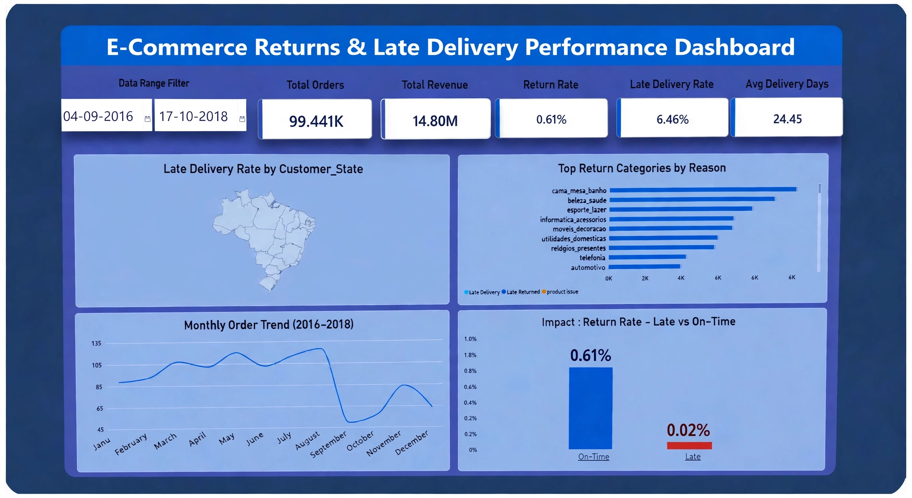

# Ecommerce Returns & Late Delivery Performance Analyzer
I did this project using the Olist Brazilian E-Commerce dataset to understand why orders get cancelled/late.
Analyzed 99K+ Brazilian orders to find why 6.46% deliveries are late & 0.61% returned.

## What I Did
- Cleaned data in Python (removed duplicates, fixed data columns)
- After Cleaning, total rows came to 99,441 orders (2016-2018)
- Loaded to PostgreSQL and did analysis in SQL
- Made dashboard in Power BI

## Dashboard

## Key Insights
**Total Orders:** 99.441K | **Total Revenue: ** 14.80M
**Return Rate:** 0.61%| **Late Delivery Rate:** 6.46% | **AVG Delivery:** 24.45 days
**Critical Finding:** On-Time return rate 0.61% vs Late return rate only 0.02% - late delivery does not drive returns
**Top Return Category:** cama_mesa_banho (bed/bath) with most issues
**Seasonality:** Orders peaked Jul-Aug 2017, dropped sharply in Sep 2017

## Tech Stack
- **SQL:** PostgreSQL queries for KPIs and delivery anaiysis
- **Python:** Data cleaning (clean.py, load_ecom.py)
- **Power BI:** 5-panel dashboard with geo map, Trend analysis, impact comparison

 ## Project Structure
 - 'SQL/Ecommerce_Analyzer.sql' - Core analysis queries
 - 'python/clean.py' - Data cleaning
 - 'python/load_ecom.py' - ETL
 - 'screenshot/dashboard.png' - Final Power BI dashboard

## Business Impact
Focused on reducing cama_mesa_banho returns and optimizing logistics for 6.46% late deliveries.

